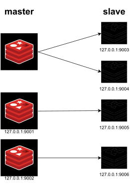

# Redis-Cluster

## Install Redis

Check the [Redis installation](https://redis.io/docs/getting-started/installation/) guide and download the latest stable version of Redis for your preferred OS.

## Visualize Redis Cluster



### Properties

- 3 master nodes
- 4 slave nodes
- 256MB memory limit

# How to use

- Clone this repository

```bash
 git clone https://github.com/samiurprapon/Redis-Cluster.git
```

- Make executable

```bash
chmod +x cluster.sh
```

- Start cluster

```bash
./cluster.sh start
```

- Stop cluster

```bash
./cluster.sh stop
```

- Reset cluster

```bash
./cluster.sh reset
```
